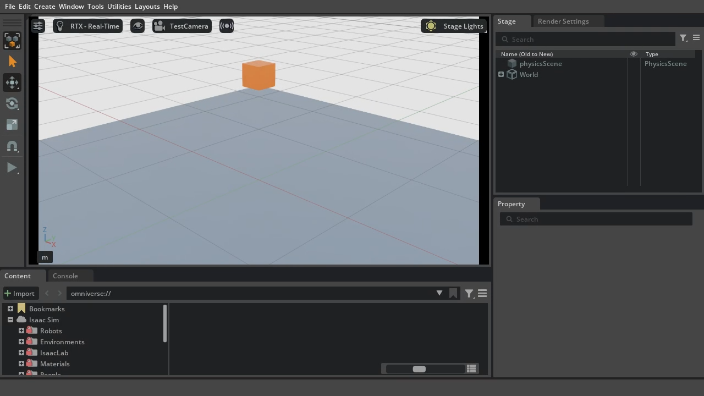

# Isaac Sim 사전 환경 점검

**수업 전 사전 준비용입니다. 연구실 데스크탑에서 Isaac Sim이 실행되는지 먼저 확인합니다.**
학생 노트북까지 화면 수신·Play 조작이 되면 원격 실습의 기본 연결도 확인할 수 있습니다.

| 구분 | 실행할 장비 | 준비하는 것 |
|---|---|---|
| 서버 | NVIDIA RTX GPU가 있는 연구실 Ubuntu 데스크탑 | 580 드라이버, Docker, NVIDIA Container Toolkit, Isaac Sim 5.1.0 |
| 화면 클라이언트 | 강의실 Ubuntu 노트북 | 공식 WebRTC 클라이언트. Isaac Sim·CUDA·Docker 설치 불필요 |

지원 자동 설치는 Ubuntu 22.04/24.04 x86_64입니다. RAM·VRAM이 권장 기준보다 작아도 경고 후 설치를 허용합니다.
RT를 지원하지 않는 GPU는 자동 설치를 진행하지 않습니다. 첫 이미지 다운로드와 셰이더 준비에는 시간이 걸리므로 수업 전에 진행하세요.
두 PC가 통신 가능한 같은 LAN에 있어야 합니다. 같은 Wi-Fi 이름이어도 학교의 기기 간 통신 차단 여부는 따로 확인해야 합니다.

## 1. 연구실 데스크탑에서 받기

AnyDesk로 데스크탑에 접속해 **데스크탑 터미널**에서 실행합니다. 기존 교육 폴더가 있어도 아래 새 폴더를 사용합니다.

```bash
git clone --branch develop --single-branch --depth 1 https://github.com/SJun99/isaacsim_preflight.git lekiwi_preflight
cd lekiwi_preflight
./lekiwi preflight check
```

`check=PASS`는 환경 검사 결과이며 Isaac Sim 실행 성공을 뜻하지 않습니다.
사전 점검에는 리더암이나 실습용 로봇이 필요하지 않습니다.

## 2. 데스크탑 설치와 자동 실행 검사

[NVIDIA Isaac Sim 라이선스](https://docs.isaacsim.omniverse.nvidia.com/5.1.0/installation/install_faq.html)를 확인하고 동의하면 실행합니다.

```bash
export ACCEPT_EULA=Y
./lekiwi preflight install
```

화면에 표시되는 설치 계획을 확인하고 sudo 인증 및 `y` 확인을 진행합니다.

- 준비된 580 계열 드라이버(580.65.06 이상)는 유지합니다. 다른 계열이면 GPU 지원 후보를 확인하고 동의 후 교체합니다.
- 드라이버 설치 후에는 작업을 저장하고 직접 재부팅합니다. Secure Boot의 MOK 등록 안내가 나오면 완료합니다.
- 재부팅 후 이 폴더에서 위 두 줄을 다시 실행하면 준비된 부분을 확인하고 이어서 진행합니다.
- 호스트 CUDA Toolkit은 따로 설치하지 않습니다. 최소 Isaac Sim 이미지만 빌드하며 LeRobot 학습 이미지는 빌드하지 않습니다.
- 설치 완료 후 창 없이 큐브의 낙하·바닥 충돌과 640×480 카메라 이미지를 자동 검사합니다.

**완료 기준: `LEKIWI_PREFLIGHT result=PASS report=.../result.json`이 나옵니다.**
이미 설치했다면 재설치 없이 `./lekiwi preflight verify`로 다시 검사할 수 있습니다.

## 3. 데스크탑에서 화면 송출 시작

데스크탑의 실제 LAN IP를 확인합니다. 아래 `192.168.0.171`은 예시입니다.

```bash
hostname -I
export ACCEPT_EULA=Y
./lekiwi preflight serve --host 192.168.0.171
```

`LEKIWI_PREFLIGHT scene=READY`가 나올 때까지 기다리고 **이 터미널은 열어 둡니다.**
처음에는 셰이더 준비로 수 분 걸릴 수 있습니다. 준비·검사는 최대 15분 기다린 후 실패 원인을 로그로 확인합니다.
이 장면에는 바닥과 주황색 큐브가 있습니다. 자동 검사 후 초기 위치로 복원하고 Play를 기다립니다.

## 4. 학생 노트북에서 화면 받기

이번에는 AnyDesk 안이 아닌 **학생 노트북의 로컬 터미널**에서 실행합니다.

```bash
git clone --branch develop --single-branch --depth 1 https://github.com/SJun99/isaacsim_preflight.git lekiwi_preflight
cd lekiwi_preflight
./lekiwi preflight client
```

공식 NVIDIA WebRTC 클라이언트 1.1.5를 내려받아 실행합니다. FUSE 설치 없이 사용자 폴더에 추출합니다.
클라이언트의 **Server에 3단계 데스크탑 IP를 입력하고 Connect**합니다. 포트는 기본값입니다.

Ubuntu에서 `No usable sandbox`, `chrome-sandbox`, `SUID sandbox` 오류가 나오면 다음 명령을 사용합니다.
이 옵션은 해당 클라이언트의 Chromium sandbox를 해제하며 시스템 보안 설정은 바꾸지 않습니다.

```bash
./lekiwi preflight client --no-sandbox
```

**완료 기준:** 노트북에 바닥·주황색 큐브가 보이고, Isaac Sim 왼쪽의 Play를 누르면 큐브가 떨어져 바닥에 멈춥니다.
Stop → Play로 같은 실험을 다시 할 수 있는지도 확인합니다. TCP 포트 연결만으로 영상 수신 성공을 판정하지 않습니다.

아래는 실제 노트북에서 수신한 준비 화면입니다. 왼쪽 삼각형 Play 버튼으로 낙하를 확인합니다.



같은 PC에서 확인할 때는 그 PC의 로컬 터미널을 하나 더 열어 `client`를 실행할 수 있습니다.
이 경우 데스크탑↔학생 노트북 사이의 네트워크 검증은 별도로 남습니다.

## 5. 결과 확인과 종료

영상 확인 후 **데스크탑의 송출 터미널에서 Ctrl+C**로 종료하고, 노트북 클라이언트 창을 닫습니다.
이 명령은 이번 점검이 만든 컨테이너만 종료합니다.

데스크탑에서 최근 결과를 확인합니다.

```bash
./lekiwi preflight report
```

`data/preflight/results/check.*/`에 다음이 보존됩니다. 학생별 결과를 강사에게 전달할 때 이 폴더를 사용합니다.

| 파일 | 내용 |
|---|---|
| `result.json` | 실행 결과·종료 코드·로그 위치. 사용자 송출 종료는 `STOPPED` |
| `environment.json` | GPU·드라이버·OS·RAM·Docker 확인 결과 |
| `verification.json` | 낙하·충돌·렌더링 검사 수치 |
| `preview.png` | 실제 렌더링한 최소 장면 |
| `sim.log` | Isaac Sim 실행·오류 로그 |

영상 수신은 학생이 직접 확인합니다. 결과의 `video_received=NOT_CHECKED`는 자동 검사가 이를 대신 판정하지 않는다는 의미입니다.
강사에게 **자동 검사 PASS 여부 / 노트북 영상 수신 여부 / Play 조작 여부**를 함께 알려 주세요.
설치 도중 실패하여 결과 파일이 아직 없다면 터미널의 마지막 오류를 전달합니다.

## 문제가 생겼을 때

| 상황 | 확인할 내용 |
|---|---|
| 재부팅 필요 안내 | 작업 저장 → 재부팅 → 2단계 두 줄 재실행 |
| sudo 비밀번호 입력 중 글자가 안 보임 | 정상 동작. 해당 PC 사용자 비밀번호를 입력하고 Enter |
| `image inspect` 실패 | 2단계 설치가 끝났는지 확인. `verify`와 `serve`는 자동 설치하지 않음 |
| 앱 준비가 오래 걸림 | 표시된 `sim.log` 확인. 실행을 중복으로 시작하지 않음 |
| `Killed` / 프로세스 강제 종료 | `free -h`로 RAM·스왑 여유 확인. 불필요한 앱·기존 Isaac Sim을 정상 종료하고 다시 검사. 운영체제 로그의 메모리 부족 여부 확인 |
| 서버 `READY`인데 노트북 화면이 안 나옴 | 서버 IP, 클라이언트 버전, 학교망·방화벽의 TCP 49100 / UDP 47998 통신 확인 |
| 포트 사용 중 / 이미 실행 중 | 기존 점검 터미널에서 정상 종료하고 다시 실행 |
| 영상은 나오지만 조작이 안 됨 | 스트리밍 영상 안을 클릭해 입력 초점을 준 뒤 Play 조작 |
| 변경 후 영상 재접속 실패 | 클라이언트를 종료하고 다시 실행해 Connect |

방화벽이나 공유기 설정을 자동 변경하지 않습니다. 통신이 차단됐다면 해당 PC·학교 네트워크 관리자와 확인합니다.

**이 점검의 PASS는 최소 장면의 실행 가능 여부입니다. 6장 전체 장면의 성능, 리더암·기록·학습·추론까지 통과했다는 의미는 아닙니다.**
설치된 Docker와 NVIDIA 드라이버 및 공식 이미지 레이어는 본 수업에서도 재사용할 수 있습니다.
본 수업용 저장소는 강사가 별도 안내하며 사전 점검 폴더는 보존합니다.
이 공개 저장소의 기본 브랜치는 `develop`이며, 전체 교재·로봇 자산·리더암·학습 코드는 포함하지 않습니다.

구현·검증 상세: [사전 점검 기록](docs/preflight-validation.md).
원격 화면 방식: [NVIDIA 공식 Livestream 안내](https://docs.isaacsim.omniverse.nvidia.com/5.1.0/installation/manual_livestream_clients.html).

## 개발자 검사

테스트에는 별도 개발 환경의 `pytest`가 필요합니다. 학생 설치 절차에는 필요하지 않습니다.

```bash
PYTEST_DISABLE_PLUGIN_AUTOLOAD=1 python3 -m pytest -q tests
```

원본 `lekiwi_isaacsim`의 `test` 커밋 `683c7f9db74291064739b932218f800a4d0f8b89`에서 사전 점검에 필요한 파일을 분리했습니다.
설치기·점검 장면·영상 실행 코드는 유지하고, 실행 메뉴와 문서를 공개 배포 범위에 맞췄습니다.
